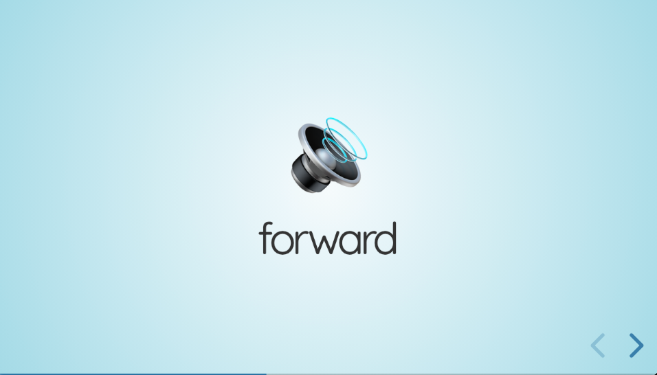

# Portfolio

Here's some projects I'm proud of. 😁

## Spelling Review

Homepage
Source Code

Spelling Review helps my daughter study for spelling tests in elementary school.
It operates like a simple slide show. The spelling word is spoken on the first
slide. On the second slide, the word is shown, so she know's how it is spelled.

I used [revealjs](https://revealjs.com/) to build the slideshow,
[Hugo](https://gohugo.io/) to publish the site and Google Cloud's
[Text-to-Speech](https://cloud.google.com/text-to-speech) API to generate audio
files.
