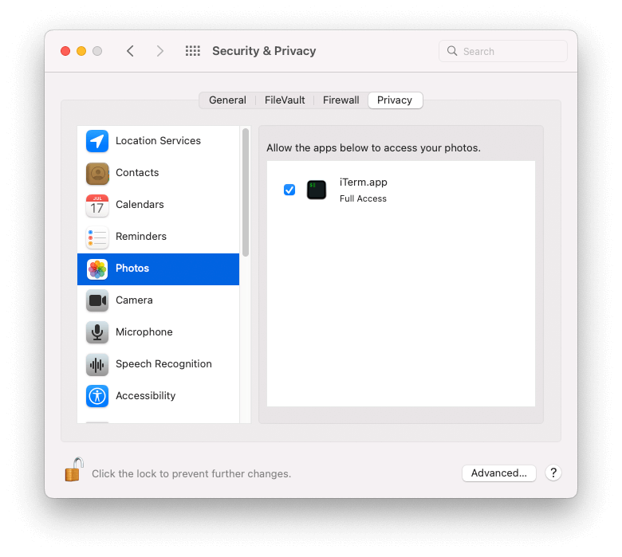

[Restic][1] is a wonderfully simple backup program. I've used it on my Linux machines for a while. I recently decided to use it on macOS as well.

```sh
restic --repo /Volumes/restic-repo --verbose backup ~/Documents ~/Pictures
```

If you run this on macOS, you might get an error like the following from restic. The error indicates that restic can't open the Photos library folder.

```plain
can not obtain extended attribute com.apple.fileprovider.ignore#P for /Users/blachniet/Pictures/Photos Library.photoslibrary:
can not obtain extended attribute com.apple.quarantine for /Users/blachniet/Pictures/Photos Library.photoslibrary:
error: Open: open /Users/blachniet/Pictures/Photos Library.photoslibrary: operation not permitted
```

Fortunately, there's an easy fix. Restic can't access the folder because of the default privacy settings on macOS. To fix this, give the terminal application (I use iTerm) permissions to access your photos.



Restart the terminal, run the backup again and rest easy knowing your files are backed up 🎉!

[1]: https://restic.net/
