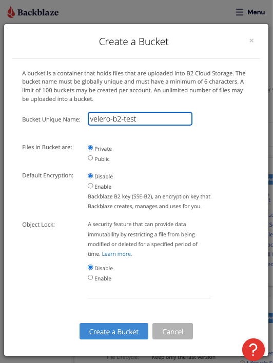
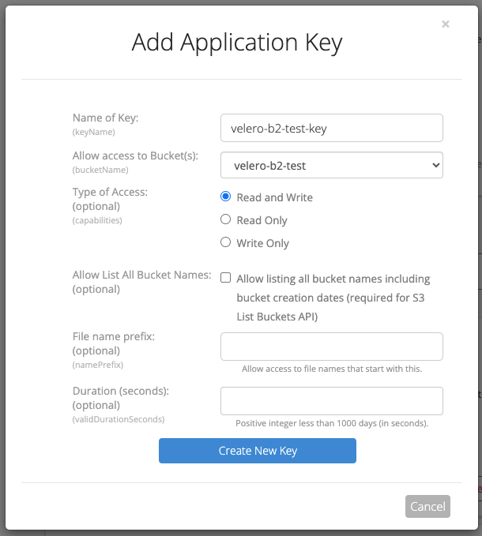
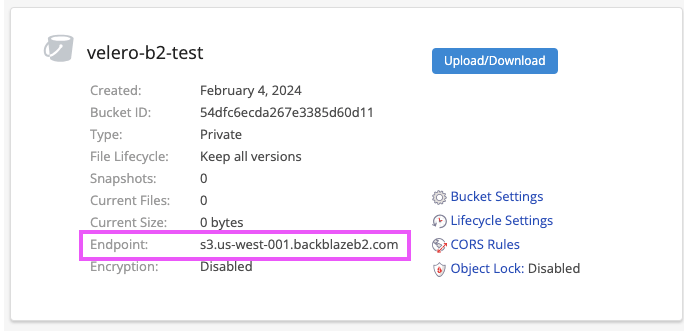

After finalizing backups from my NAS and household computers to Backblaze's B2 Cloud Storage, I decided it was time to do the same for my Kubernetes cluster. I use the built-in backup utility on my NAS and [Restic](https://restic.readthedocs.io/en/stable/) on my household computers. After a little research, I found that [Velero](https://velero.io/) is a solid option for backing up Kubernetes clusters. It supports storage providers that have an AWS S3-compatible API, which includes [B2 Cloud Storage](https://www.backblaze.com/docs/cloud-storage-s3-compatible-api)!

In this post, I'll walk through a minimal Velero install that saves snapshots to B2 using the `aws` provider.

> **📝 Software versions**
>
> Examples in this post were tested with the following software versions:
> - Velero CLI v1.13.0
> - Velero plugin for AWS v1.8.2
> - K3s v1.28.6+k3s2

## In praise of Backblaze

Before we dive in, allow me a moment to express my love for [Backblaze](https://www.backblaze.com/). ❤️🔥

I have used Backblaze products since "CrashPlan for Home" was discontinued. I started off with Backblaze Computer Backup and it paid off when the drive holding all my important documents and photos died.

It was a fairly large amount of data, so I took advantage of "Restore by Mail" which is where Backblaze mails a USB Hard Drive with a snapshot of your backup. A couple days later I had restored all my files on a new NAS and was returning the hard drive! 🎉

I can't give Backblaze enough praise for how smooth the process was to restore my data! It was a welcome relief in a normally stressful situation.

Alright, with my gushing out of the way, let's dive in...

## Create the bucket and application key

To start we will create a bucket and application key in Backblaze. I'm going to use the web UI, but you may be able to complete some or all of these steps using the [Backblaze CLI](https://www.backblaze.com/docs/cloud-storage-command-line-tools).

Create a [B2 Cloud Storage Bucket](https://secure.backblaze.com/b2_buckets.htm) with the following options. This is where Velero will store backups.

| Option              | Value              |
| ------------------- | ------------------ |
| Bucket name         | `<my-bucket-name>` |
| Files in bucket are | Private            |
| Default Encryption  | Disable            |
| Object Lock         | Disable            |



Create an [Application Key](https://secure.backblaze.com/app_keys.htm) with access to the bucket. Velero will use these credentials to authenticate with Backblaze.

| Option                    | Value              |
| ------------------------- | ------------------ |
| Name of Key               | `<my-app-name>`    |
| Allow access to Bucket(s) | `<my-bucket-name>` |
| Type of Access            | Read and Write     |
| File name prefix          | _blank_            |
| Duration (seconds)        | _blank_            |



Save the Application Key credentials to a file named `credentials.txt`. We'll need this file when installing the Velero server components later.

```ini
# credentials.txt
[default]
aws_access_key_id=<b2_keyID>
aws_secret_access_key=<b2_applicationKey>
```

Take note of your bucket's "Endpoint" by viewing the bucket information in [B2 Cloud Storage Buckets](https://secure.backblaze.com/b2_buckets.htm). It will look something like this: `s3.us-west-001.backblazeb2.com`. You will need this when installing Velero server components.



You will also need the region for your bucket, which is the second part of that endpoint. For example, in `s3.us-west-001.backblazeb2.com`, the region is `us-west-001`.

## Install Velero

A basic Velero install involves two components: the CLI and the server. You should install the CLI on the same machine that you generally run `kubectl` on. Once the CLI is installed, we'll use it to install the server components in the Kubernetes cluster.

Follow the instructions in [Basic Install](https://velero.io/docs/v1.13/basic-install/) to install the CLI.

Now use the CLI to install and configure the Velero server components in the Kubernetes cluster. Run the following command, replacing `<...>` with the values from your Backblaze setup.

```sh
velero install \
  --provider aws \
  --bucket <my-bucket-name> \
  --plugins velero/velero-plugin-for-aws:v1.8.2 \
  --secret-file credentials.txt \
  --backup-location-config region=<my-bucket-region>,s3Url=https://<my-bucket-endpoint> \
  --snapshot-location-config region=<my-bucket-region>
```

Follow instructions in the output to review the logs and ensure that the install completed successfully.

## Backup and restore

Most of your interactions with Velero will happen through the CLI. With it you can get, create, and delete backups and restores.

Let's test out the backup and restore functionality. To do that, we will:

1. Deploy nginx.
2. Create a backup with Velero.
3. Delete nginx.
4. Restore the backup with Velero.
5. Confirm nginx was restored.

Create an nginx deployment and service.

```sh
kubectl create deployment nginx --image=nginx:latest
kubectl expose deployment nginx --port=80 --name=nginx
```

Wait for the deployment to ready and then test it.

```sh
# Wait for the deployment to ready.
kubectl rollout status deployment nginx

# Make a request.
curl http://$(kubectl get svc nginx --output=go-template={{.spec.clusterIP}})
```

Backup the cluster.

```sh
velero create backup b01 --wait
```

Delete nginx.

```sh
kubectl delete deployment/nginx service/nginx
```

Restore from our earlier backup.

```sh
velero create restore --from-backup=b01 --wait
```

Wait for the deployment to ready and then test it.

```sh
# Wait for the deployment to ready.
kubectl rollout status deployment nginx

# Make a request.
curl http://$(kubectl get svc nginx --output=go-template={{.spec.clusterIP}})
```

You should get a successful response from your `curl` request, indicating that you successfully restored your Kubernetes resources!
