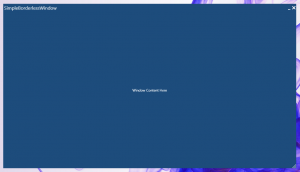

[](http://blachniet.com/wp-content/uploads/2012/06/BorderlessWindow.png) I've put together a very simple borderless WPF window that complements Microsoft's Metro style quite well. I won't go into a lot of detail here, since the code does most of the talking, but I will go over the important parts here. If you want to skip right to the source code, you can find it over at GitHub: [http://bit.ly/N7afKQ](http://bit.ly/N7afKQ)

Starting with a fresh window set and the window properties `WindowStyle="None"`, `AllowsTransparency="True"`, and `ResizeMode="CanResizeWithGrip"`. This will give you your starting borderless window that is resizable from the bottom-right corner.

```xml
<Window x:Class="SimpleBorderlessWindow.MainWindow"
    xmlns="http://schemas.microsoft.com/winfx/2006/xaml/presentation"
    xmlns:x="http://schemas.microsoft.com/winfx/2006/xaml"
    Title="MainWindow"
    Height="562"
    Width="1000"
    WindowStyle="None"
    AllowsTransparency="True"
    ResizeMode="CanResizeWithGrip">  
```

A `DockPanel` is used to group together all the top elements (window title, draggable area, close/minimize buttons). Two `TextBlock`s with `Hyperlink`s docked to the right make up the minimize and close buttons. A `StatusBar` with the window title makes up the rest of the area, and defines the _draggable_ area.

```xml
<DockPanel>
    <DockPanel DockPanel.Dock="Top">
        <TextBlock DockPanel.Dock="Right"
                   VerticalAlignment="Center">
            <Hyperlink Click="TriggerClose"
                       Style="{StaticResource WindowIconStyle}">r</Hyperlink>
        </TextBlock>
        <TextBlock DockPanel.Dock="Right"
                   VerticalAlignment="Center">
            <Hyperlink Click="TriggerMinimize"
                       Style="{StaticResource WindowIconStyle}">0</Hyperlink>
        </TextBlock>
        <StatusBar Background="Transparent"
                   MouseDoubleClick="TriggerMaximize"
                   MouseMove="TriggerMoveWindow">
            <TextBlock DockPanel.Dock="Left"
                       Text="SimpleBorderlessWindow"
                       FontSize="16"/>
        </StatusBar>

    </DockPanel>

    <Grid>
        <TextBlock Text="Window Content Here"
                   HorizontalAlignment="Center"
                   VerticalAlignment="Center" />
    </Grid>
</DockPanel>
```

A style is used to make the icons change color when the mouse is over them. This also removes the underlining, the hand cursor, and sets the font to Webdings which gives us some nice icons.

```xml
<Window.Resources>
    <Style x:Key="WindowIconStyle"
           TargetType="{x:Type Hyperlink}">
        <Setter Property="FontFamily"
                Value="Webdings" />
        <Setter Property="FontSize"
                Value="16" />
        <Setter Property="Foreground"
                Value="White" />
        <Setter Property="TextBlock.TextDecorations"
                Value="{x:Null}" />
        <Setter Property="Cursor"
                Value="{x:Null}" />
        <Style.Triggers>
            <Trigger Property="IsMouseOver"
                     Value="True">
                <Setter Property="Foreground"
                        Value="#ED5326" />
            </Trigger>
        </Style.Triggers>
    </Style>
</Window.Resources>
```

Finally you just have to hook up the events in your code behind. _OMG, Did he say code-behind!!!_ - yup. I love MVVM, and try to avoid code behind in general, but this functionality seems like it belongs in the view layer (which the code-behind falls into the view layer here). You can still easily hook this view up to a view model, and use everything else in the beautiful MVVM way.

```csharp
public partial class MainWindow : Window
{
    public MainWindow()
    {
        InitializeComponent();
    }

    private void TriggerMoveWindow(object sender, MouseEventArgs e)
    {
        if (e.LeftButton == MouseButtonState.Pressed)
        {
            if (WindowState == System.Windows.WindowState.Maximized)
            {
                WindowState = System.Windows.WindowState.Normal;

                double pct = PointToScreen(e.GetPosition(this)).X / System.Windows.SystemParameters.PrimaryScreenWidth;
                Top = 0;
                Left = e.GetPosition(this).X - (pct * Width);
            }

            DragMove();
        }
    }

    private void TriggerMaximize(object sender, MouseButtonEventArgs e)
    {
        if (WindowState == System.Windows.WindowState.Maximized)
            WindowState = System.Windows.WindowState.Normal;
        else if (WindowState == System.Windows.WindowState.Normal)
            WindowState = System.Windows.WindowState.Maximized;
    }

    private void TriggerClose(object sender, RoutedEventArgs e)
    {
        Close();
    }

    private void TriggerMinimize(object sender, RoutedEventArgs e)
    {
        WindowState = System.Windows.WindowState.Minimized;
    }
}
```

The full source code can be found over at GitHub at [http://bit.ly/N7afKQ](http://bit.ly/N7afKQ). Please feel free to contribute or offer any suggestions.
