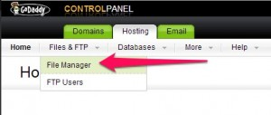
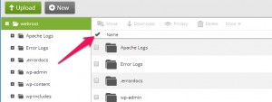
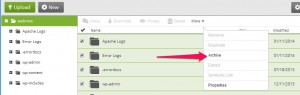
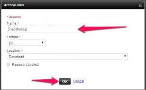

**UPDATE :** This article provides a manual approach to creating a development copy of your website. However, I ran across [this WPBeginner article](http://www.wpbeginner.com/wp-tutorials/how-to-move-live-wordpress-site-to-local-server/) which describes a much easier approach using the [Duplicator plugin](http://wordpress.org/plugins/duplicator/). I would suggest following that guide unless you prefer the manual process.

## Before We Start

Here's my environment setup. This post should still be helpful if your setup isn't exactly the same, though.

- GoDaddy Hosting (production)
- [WAMP](http://www.wampserver.com/en/) (development)
- phpMyAdmin (production + development)

## Files

### Download WordPress Files

Instead of using the WordPress export feature, we're going to grab all site's files. I'm going to use GoDaddy's File Manager to get the files because it can archive all the files in a single zip which I can then download. If you are not using GoDaddy and your host doesn't offer something similar then you can pull all the files over FTP using [FileZilla](https://filezilla-project.org/).

The screenshots below show how I archived my files for download.

\[caption id="attachment\_831" align="aligncenter" width="300"\]\[\][2](http://blachniet.com/wp-content/uploads/2014/01/Screenshot_011114_022739_PM.jpg) Open the GoDaddy File Manager.\[/caption\]\[caption id="attachment\_832" align="aligncenter" width="300"\][](http://blachniet.com/wp-content/uploads/2014/01/Screenshot_011114_022823_PM.jpg) Select all the files you wish to download.\[/caption\]\[caption id="attachment\_829" align="aligncenter" width="300"\][](http://blachniet.com/wp-content/uploads/2014/01/Screenshot_011114_023026_PM.jpg) In the More dropdown select Archive.\[/caption\]\[caption id="attachment\_830" align="aligncenter" width="300"\][](http://blachniet.com/wp-content/uploads/2014/01/Screenshot_011114_023113_PM.jpg) Insert a name for the archive and download it.\[/caption\]

### Extract and Configure

- Extract the files from the archive to your site directory (e.g. `C:\wamp\www\site_name`).
- Update the `wp-config.php` `DB_HOST` (probably to `localhost`)
- Update other DB login info if it will be different than your production instance.
- If you are using non-default Permalink settings, ensure that the `rewrite_module` is enabled on your Apache instance.

## Database

I'm going to assume that you are familiar administrating with phpMyAdmin and MySQL.

### Export the Production Database

- Login to your production phpMyAdmin instance.
- Select your database
- Select the export tab.
- Export you database to a SQL file.

### Set Up the Development Database

- Login to your development phpMyAdmin instance.
- Create a new user + database, preferably with the same name as the production instance.
- _Make sure the host for the user is correct._ It probably needs to be `localhost`.

### Import Data

Open the MySQL command prompt to your database.

```sh
> mysql --user=user_name --password=P@assw0rd database_name
```

In the mysql database prompt, execute the SQL file you exported.

```sh
mysql> source database_name.sql
```

Change your site's location in the database with the following SQL. You will need to replace `http://my.web.zz/dev` with the URL to your developer instance.

```sql
SELECT * FROM wp_options WHERE option_name = "home" OR option_name = "siteurl";
UPDATE wp_options SET option_value = "http://my.web.zz/dev" WHERE option_name = "home" OR option_name = "siteurl"
```

## Wrap-Up

That should be everything you need to do. If your WAMP instance is running, you should be able to browse to your site. If you have any problems or suggestions, leave them in the comments below.

## References

- [Running a Development Copy of Wordpress | WordPress Codex](http://codex.wordpress.org/Running_a_Development_Copy_of_WordPress)
