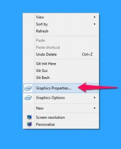
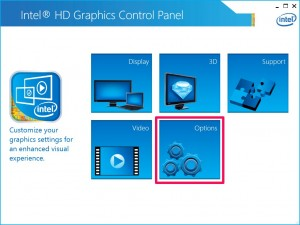
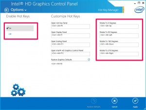

If this is happening to you, it could be because you are using the Intel HD Graphics drivers. You'll certainly notice this issue if you use [Sublime Text](http://www.sublimetext.com/) since it uses the same key combination to expand the multiline editing.

To resolve the issue you can either change Intel's keys or turn them off entirely.

- Right click on you desktop and select `Graphics Properties` in the context menu.  
    
    
- Select `Options`  
    
    
- Either turn the hot keys off, or change their bindings.  
    
