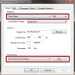
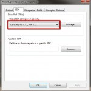
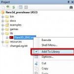
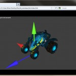

 This post is a simple walkthrough for getting the latest Flare3D pre release (2.0.42) and the latest FlashDevelop (4.0.0 RC1) working together nicely. This post builds on an older how-to done by the Flare3D team which can be found [here](http://www.flare3d.com/blog/2011/03/10/flare3d-2-0-startup-with-flashdevelop/). 

1. ##### Get the latest FlashDevelop
    
    - Download FlashDevelop 4.0.0 RC1 [here](http://www.flashdevelop.org/community/viewtopic.php?f=11&t=8785&sid=4b0fd07471375ee4ded3e93275bda0e9).
    - Run the installer.
        - Make sure that you install Flex 4.5 SDK as part of the FlashDevelop installation. The installer will do this by default.
2. ##### Get FlashPlayer 11
    
    - Download the latest FlashPlayer [here](http://get.adobe.com/flashplayer/).
    - Note that Chrome updates its FlashPlayer automatically, and at the time of this posting, it was still at version 10.3. You may have to use a different browser, such as Firefox. See Nick H's comment below on how to use FlashPlayer 11 in Chrome by disabling the default player plug-in.
3. ##### Get Flare3D 2.0 Pre-Release
    
    - Sign up [here](http://www.flare3d.com/signup20) to get a download link emailed to you.
    - Unzip the downloaded files.
4. ##### Configure the Project
    
    - Open **flare3d\_prerelease.as3proj** in FlashDevelop
    - Open the project properties (right click on the project and select "Properties"li>
    - In the Output tab, Platform group box, select Flash Player version 11.0
    
      
    
    - To automatically launch in Firefox:
    
    - In the Test Project group box (still Output tab) select '**Run Custom Command...**', click Edit, and enter '**firefox.exe bin\\index.html**'
    
    - Go to the SDK tab and make sure that Flex 4.5.1, AIR 2.7 is the selected SDK
    
      
    
    - Go to the Compiler Options and add '**lib\\Flare3D\_2042.swc**' to the SWC Libraries array. Right click on '**lib\\Flare3D\_2042.swc**' in the project tree and check '**Add to Library**'. Thanks to Philippe for this suggested change.
    
    
5. ##### Run an example
    
    - Open the '**examples**' folder in the project
    - Right click on **Test01\_The\_Basics1.as**
    - Click Document Class
    - Build & Launch by pressing _Ctrl+Enter_
    
    __
