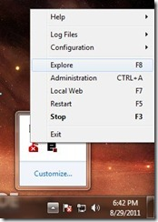
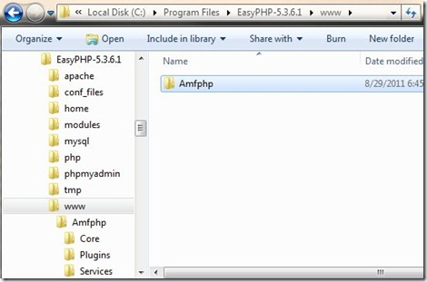
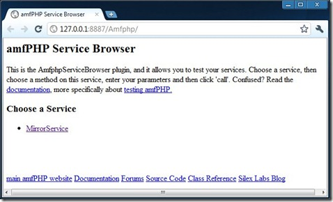
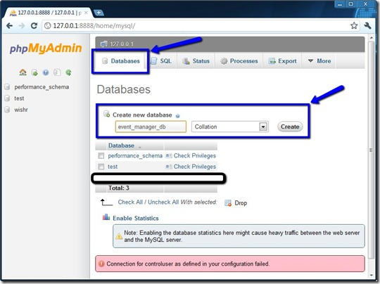
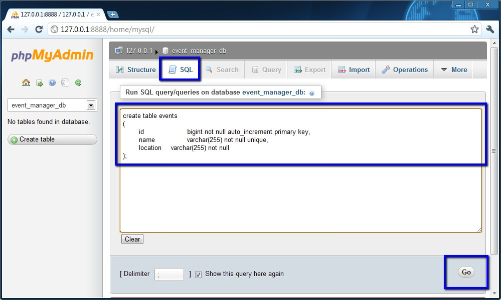

A core need of many online Flash applications is to store data in an online database. Supporting this need requires the integration of a few different technologies. The solution that I will be walking you through in this and the next tutorial post will integrate AS3, PHP, MySQL, and amfphp. This post will contain the boring, yet necessary, setup steps. This includes installing all tools and frameworks as well as creating the MySQL database to store your application data.

To demonstrate how to create a storage service for your Flash application, we are going to create a simple event management application. This Flash application will allow you to create, delete, and view events. All of the data for these events will be stored in a MySQL database via a PHP service. I do not own the Flash GUI, so we won't be looking at any actual graphics for this application. We will just create the code to support the inexistent GUI.

## Toolbox

- [FlashDevelop](http://www.flashdevelop.org/community/viewforum.php?f=11) - This is the IDE that we will use to write all our code. It has built in support for ActionScript and PHP. I will be using version 4.0.0 Beta.
- [EasyPHP](http://www.easyphp.org/) - This is a development environment for a WAMP server (Windows, Apache, MySQL, PHP). As the name suggests, it is easy to use and requires almost no configuration. You get all the components installed at once, and there's no configuration text files to mess with. This is by far the easiest way to get started with PHP development.
- [amfphp](http://projects.silexlabs.org/?/amfphp) - This library provides us with an easy way to create PHP services that ActionScript can communicate with using the [Action Message Format](http://en.wikipedia.org/wiki/Action_Message_Format).

## Get the Server Up Install

_FlashDevelop_ and _EasyPHP_, and unzip _Amfphp_. After installing and running _EasyPHP_, right-click on the **e** on your task bar and select **Explore**.

[](http://blachniet.com/wp-content/uploads/2011/08/easyphp_1.jpg)

This opens the top level directory that _EasyPHP_ is serving. Copy your extracted _Amfphp_ folder to this folder. You’re file structure should look something like this:

[](http://blachniet.com/wp-content/uploads/2011/08/amfphp_0.jpg)

To make sure that everything is setup properly, navigate you favorite browser to [http://127.0.0.1:8887/Amfphp/](http://127.0.0.1:8887/Amfphp/). You should see a page similar to this:

[](http://blachniet.com/wp-content/uploads/2011/08/amfphp_2.jpg)

Mess around with the `MirrorService` to make sure that everything seems to be working properly.

## Create the Database

Now let’s get the database set up. Right click on the **e** for _EasyPHP_ in your task bar and select **Administration**. On the Administration page, click the big green button that says _Manage Your Databases_. If your browser takes you to your _phpMyAdmin_ page, then everything is fine and you can skip the next paragraph. If you got errors saying that you could not login, then it is probably because you have already installed _MySQL_ and have set a password for the **root** user account. To fix this, open `C:\Program Files\EasyPHP-5.3.6.1\phpmyadmin\config.inc.php` (modify that path to match your setup if necessary). You will need to change the following 2 fields.

```php
$cfg['Servers'][$i]['password'] = 'yourPassword'; 
$cfg['Servers'][$i]['AllowNoPassword'] = false;
```

Once you have successfully logged into _phpMyAdmin_, click the _Databases_ tab, enter the name for your database, and click _Create_.

[](http://blachniet.com/wp-content/uploads/2011/08/phpMyAdmin_0.jpg)

Click on your newly created table, go to the _SQL_ tab, enter the following SQL code, and click _Go._

```sql
create table events 
( 
    id bigint not null auto_increment primary key, 
    name varchar(255) not null unique, 
    location varchar(255) not null 
); 
```

[](http://blachniet.com/wp-content/uploads/2011/08/phpMyAdmin_2.jpg)

All the boring setup is now complete. You have a working PHP server, a database to store your application data, and a framework to create services that can communicate with ActionScript.  In Part 2 of this tutorial we will go over actually creating the PHP service that will manage this database as well as the AS3 that will communicate with the PHP service. If you have any trouble, or notice any typos, please let me know.
