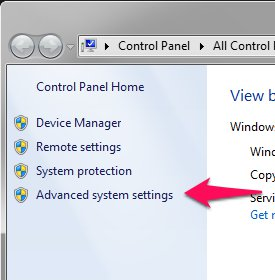
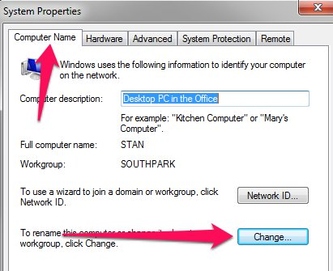
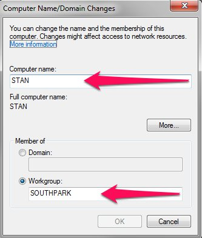
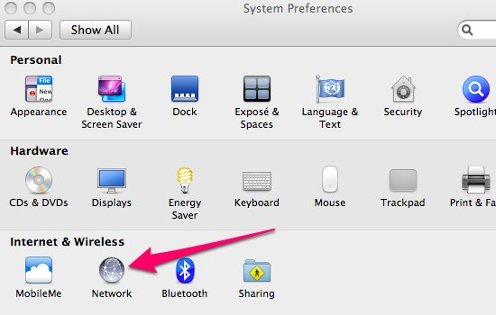
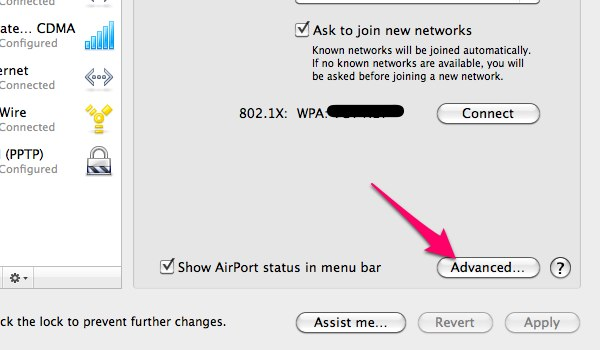
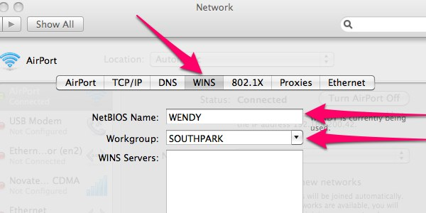

One of the first things you should do when setting up your home network is decide on a naming scheme. Have fun with this part. You will need to pick a workgroup name as well as names for each of your computers/devices.

I like the TV show _South Park_, so I decided to base my network device names on _South Park_ characters. My workgroup name is **SOUTHPARK**, my main desktop is named **STAN**, my wife's computer is named **WENDY**, and my server is named **BUTTERS**. You might want to base your naming scheme on [Mario Kart characters]([http://en.wikipedia.org/wiki/Mario_Kart#Characters]), [Transformers]([http://en.wikipedia.org/wiki/List_of_The_Transformers_characters]), [Zelda Characters]([http://en.wikipedia.org/wiki/Characters_in_The_Legend_of_Zelda_series]), [Chevy cars]([http://en.wikipedia.org/wiki/List_of_Chevrolet_vehicles]), [horse breeds]([http://en.wikipedia.org/wiki/Horse_breeds]), [Game of Thrones houses]([http://gameofthrones.wikia.com/wiki/Great_Houses]), or something else you are interested in.

It's important that you be consistent with the capitalization of your device names. I generally stick with all-caps names. You'll also want to name your WiFi network. I named mine the same as my workgroup.

## Windows 7 - Set Computer Name/Workgroup

1. Open the Start Menu, right click _Computer_, and click _Properties_
2. In the left column, select _Advanced system settings_ 
    
3. Select the _Computer Name_ tab and click the _Change..._ button. 
    
4. Insert your desired computer name and workgroup name 
    

## Mac - Set Computer Name/Workgroup

1. Open System Preferences | Network 
    
2. Select the Advanced option 
    
3. Select the WINS tab and enter your desired computer name and workgroup 
    

## Ubuntu - Set Computer Name/Workgroup

I don't have a Ubuntu system up and running at the moment, so I'll point you to an article over on [Liberian Geek](http://www.liberiangeek.net/) for instructions on this one: [Windows 7 vs. Ubuntu 12.04: How to Change System Workgroup](http://www.liberiangeek.net/2012/05/windows-7-vs-ubuntu-12-04-how-to-change-system-workgroup/). The Ubuntu portion is about half-way down the page.

## Android/iOS - Set Computer Name/Workgroup

This doesn't seem to be possible with most Android/iOS devices without rooting or jail braking them. Sorry if I got your hopes up.
