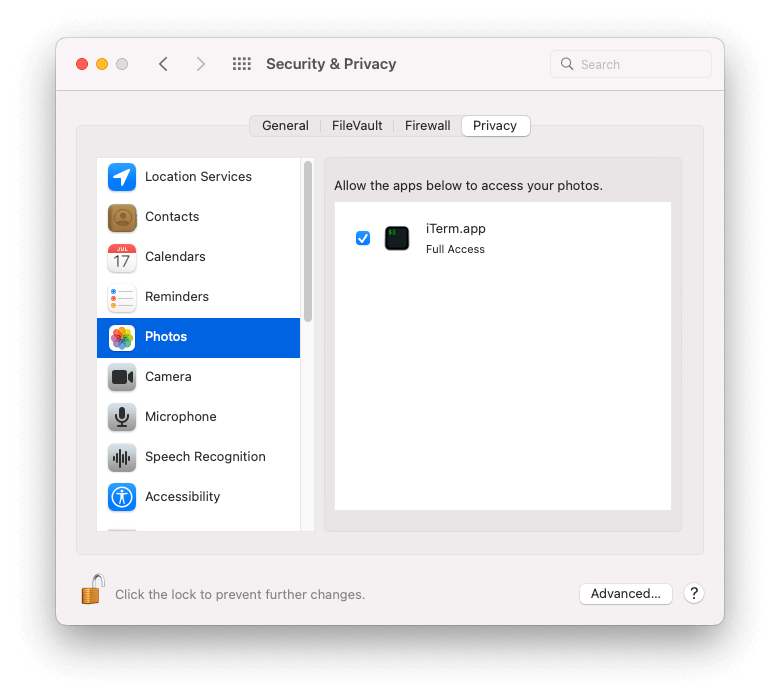

I've recently had a lot of trouble with Time Machine backups to my Synology NAS DiskStation getting corrupted 😱. I need to dig in more to figure out what's going on here, because I really like the simplicity of the built-in Time Machine interface for browsing and restoring file history. In the meantime, though, I need a backup solution that I can trust.

That's where [restic][1] comes in! 🤩

I've had a lot of success using restic to back up my Linux machines. Now I'm using it to back up my MacBook (alongside Time Machine while I figure out why Time Machine keeps breaking).

I've only run into one issue using restic on macOS so far. It had trouble backing up my Photos library.

```sh
restic --repo /Volumes/restic-repo --verbose backup ~/Pictures
```

Restic reports an error indicating that it can't open the Photos library folder.

```plain
can not obtain extended attribute com.apple.fileprovider.ignore#P for /Users/blachniet/Pictures/Photos Library.photoslibrary:
can not obtain extended attribute com.apple.quarantine for /Users/blachniet/Pictures/Photos Library.photoslibrary:
error: Open: open /Users/blachniet/Pictures/Photos Library.photoslibrary: operation not permitted
```

Fortunately, there's an easy fix. Restic can't access the folder because of the macOS default privacy settings. To fix this, just give the terminal application (I use iTerm) permissions to access your photos.



Restart the terminal, run the backup again and rest easy knowing your photos are backed up 🎉!

[1]: https://restic.net/
