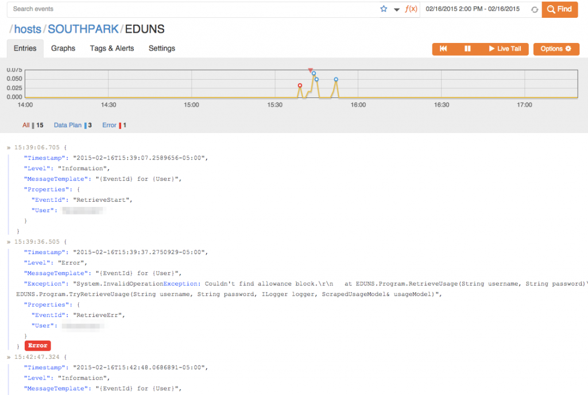
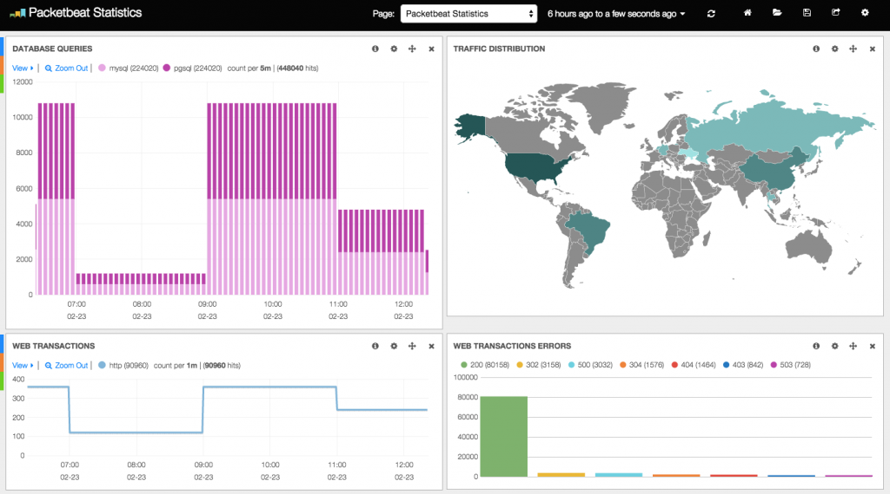

ThoughtWorks recently released their [Technology Radar report for January 2015](http://www.thoughtworks.com/radar) and **structured logging** was among the techniques that they strongly suggested that the industry adopt. I've actually had some exposure to structured logging over the past year and have been very happy with the results. So, I thought I would share my experience.

My first exposure to structured logging was in early 2014. I was creating a simple Python application to monitor the amount traffic through my modem throughout the day and I was logging events from my application to [logentries](http://logentries.com). I had just learned that **logentries** could [extract key-value pairs from log events](https://logentries.com/doc/search/) so I started formatting my log events to allow that (e.g. `event=trafficUpdate megabytes=64.32`). I then [configured an alert](https://logentries.com/doc/tagsalerts/) to send me an email whenever the `megabytes` exceeded some value. I was really happy with this introduction to structured logging and, naturally, I wanted more.

\[caption id="attachment\_997" align="aligncenter" width="660"\] [Logentries](http://logentries.com) is a cloud logging service that can extract key-value pairs from log events.\[/caption\]

I wanted to bring what I had learned to work and apply it to our products, but we generally work in an offline environment, so using **logentries** was not an option. I was also tired of having to work so hard to manually format the log events to ensure that they could be parsed by the logging system. [Serilog](http://serilog.net/) solved the formatting problem for me and the [ELK stack](http://www.elasticsearch.org/) provided the solution for storing and viewing log events in an offline network.

[Serilog](http://serilog.net/) is a logging library for .NET that makes it easy to generate and deliver structured logs. It ships with many different sinks - _plugins to deliver log events to different providers_ - one of which is the [Elasticsearch sink](https://github.com/serilog/serilog/wiki/Provided-Sinks#elasticsearch). [Elasitcsearch](http://www.elasticsearch.org/overview/elasticsearch/) (**E**LK) is a distributed NoSQL datastore that provides tools that make it a great destination for log events. [Logstash](http://www.elasticsearch.org/overview/logstash/) (E**L**K) is a service for collecting, parsing and storing logevents from different sources into Elasticsearch databases, and [Kibana](http://www.elasticsearch.org/overview/kibana/) (EL**K**) is a web application for visualizing the log event data. Serilog is actually capable of delivering log events directly to Elasticsearch in the Logstash format, so you can skip Logstash altogether if you are only ingesting events from Serilog.

\[caption id="attachment\_1000" align="aligncenter" width="660"\] This screenshot shows Kibana being used in the [Packetbeat demo](http://packetbeat.com/).\[/caption\]

I used this trio (Serilog, Elasticsearch and Kibana) in one of our new products and I have been very happy with the results. With well structured log events, we are able to extract metrics from and gain insights into our application that we had to build separate systems to support in the past. Previously, when we wanted to be able to obtain some metrics from our applications, we would create an application to import logs into a database specialized for storing those metrics and a front-end application for viewing those metrics. While there's certainly still room for that sort of specialized setup, our new structured logging approach made it really easy to get started extracting this data with very little effort. If we decide that we want to extract some new metric, all we have to do is add a log event to the application to communicate that metric and configure a Kibana widget to display the data in a pretty graph. No code changes required to a log importer, database schema, or front-end viewer.

_[Model of graphene structure by CORE-Materials used under Creative Commons.](https://www.flickr.com/photos/core-materials/5057399792/in/photolist-8GUuL9-6cz8dU-iy7PQq-aGkrG-77Hs2y-8VpwiL-cMwCjo-2uNVSU-4nB7Up-4sVzwA-4c9EEF-cMwNxY-cvA52j-9Rm3R6-9mKv7C-ZW53-6y5xPw-9s4JQM-5i8H9T-ekarjY-6X3Sth-cMwLhj-nSoAuh-5RQUHy-ZW54-8mSzJ6-8mVHrd-5dwEcg-cMwJ2h-mCg3W-oN7QaS-7JyUuS-f9DnFZ-oN7mE3-75S2Cf-aA6Q9P-esNFPy-8kkG69-48TSBm-4myKSw-91xN7a-91iZYN-nVgzoa-6DGe1C-jcDsg6-8M5Nsx-2Di7W3-By5oG-6Vr52x-apU3tB/)_
