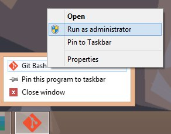

[VagrantPress](https://github.com/chad-thompson/vagrantpress) and [VVV](https://github.com/Varying-Vagrant-Vagrants/VVV) use the [Vagrant::Hostsupdater](https://github.com/cogitatio/vagrant-hostsupdater) plugin to allow you to access your development WordPress sites at a friendlier URL (e.g. http://vagrantpress.dev instead of http://localhost:8080). On Windows machines, the plugin updates the file at `C:\Windows\System32\drivers\etc\hosts`, but modifying this files requires admin access. You must run your shell as an administrator for the plugin to be able to update this file when you `vagrant up`.

_BONUS_: I've seen a lot of people installing Cygwin or Putty just to be able to use Vagrant on Windows (since it requires SSH). If you have Git Bash installed on your machine, which is included in the standard [git](https://git-scm.com/) installer for Windows, you can use that instead. I've always used Git Bash and haven't run into any serious limitations while working with Vagrant.
