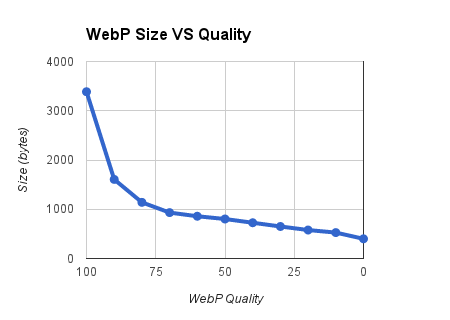

Apparently Google has started using [WebP image format](https://developers.google.com/speed/webp/) with the redesign of the [Google Play store](http://play.google.com). Only Chrome supports the image format at the moment, so if you are using another browser you will get the standard `PNG`.

I did a quick test to see how big of a difference it actually makes. I grabbed the icon from the [Chrome Browser](https://play.google.com/store/apps/details?id=com.android.chrome&hl=en) page on Chrome and then on IE. When downloaded, Chrome's `WebP` file was **11.5KB** vs **93.8KB** for IE's `PNG`!

After seeing that, I decided to give it a shot with my icon. You can grab the tools to convert `PNG`s to `WebP` files from the [WebP download page](https://developers.google.com/speed/webp/download). The `cwebp` utility does this particular conversion. It takes an input, output and quality (0-100).

```
cwebp [options] -q quality input.png -o output.webp
```

I tried the logo at some of the different quality levels to see how much of a difference they make in size. The original size of my `PNG` was 3625 bytes. As you can see in the chart below, there's a huge difference when you drop the quality to `90`, and then there is a more gradual drop as you go any lower. _For my logo, there was noticeable changes in quality at the `80` mark, but that will vary depending on your image._



Since `WebP` is not yet natively supported by browsers other than Chrome, you probably don't want to jump to it quite yet. You can still reduce the size of you `PNG`s by using optimizers like [TinyPNG](http://tinypng.org/). As an example, I used [TinyPNG](http://tinypng.org/) to optimize the same logo and it reduced the size from 3625 bytes to 1991 bytes, which would put you just a little above the `90` `WebP` with no noticeable difference in quality.

If you just can't wait for other browsers to support the format (assuming they ever do), check out the [WebPJS](http://webpjs.appspot.com/) library, which adds support for the new format to some browsers via a JavaScript library.
