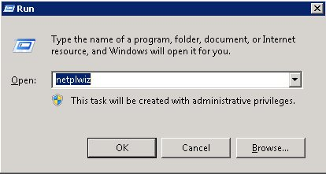
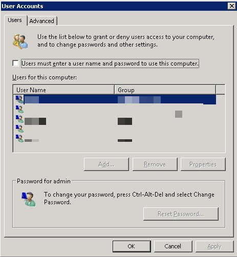
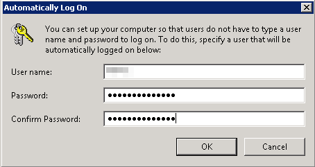

I have a few applications installed on my home server that are user-level applications, meaning that a user must be logged on in order for the application to start. I don't want to have to manually log on ever time my server restarts, so I set up automatic log on for the server. Here's how to do it.

- Press `Windows Key` + `R` to launch the run dialog.
- Type in `netplwiz` and click `OK`. 
- In the dialog disable _Users must enter a username and password to use this computer_.  
    
- Click _Apply_ and a dialog will appear. Enter the user name and password of the account that you would like to be automatically logged in.  
    

That's all there is to it. Having an automatic log on does not change the need to log on when using remote desktop to log on. I would suggest that you automatically log on to a standard account, not an admin account. That way if someone does sit down in front of the computer and start messing with things they shouldn't, they can only do so much damage.
