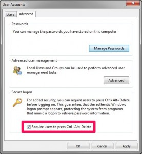

You may have noticed that before you log on to you office PC that you are required to press `CTRL+ALT+DELETE` before entering you user name and password. Apparently, this is actually a security feature. According to [this Windows support article](http://windows.microsoft.com/en-us/windows-vista/enable-or-disable-secure-logon-ctrl-alt-delete) (which this post is based on), _\[w\]hen secure logon is enabled, no other program (such as a virus or spyware) can intercept your user name and password as you enter it._. To enable secure log on, follow the steps below.

- Hit `Windows Key + R` to launch the run dialog, and enter `netplwiz` and click **OK**
- Click the _Advanced_ tab and enable **Require users to press Ctrl+Alt+Delete** and then click **OK**\]

